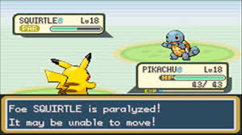
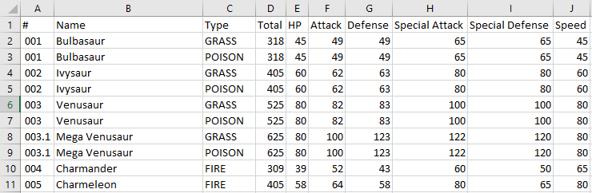
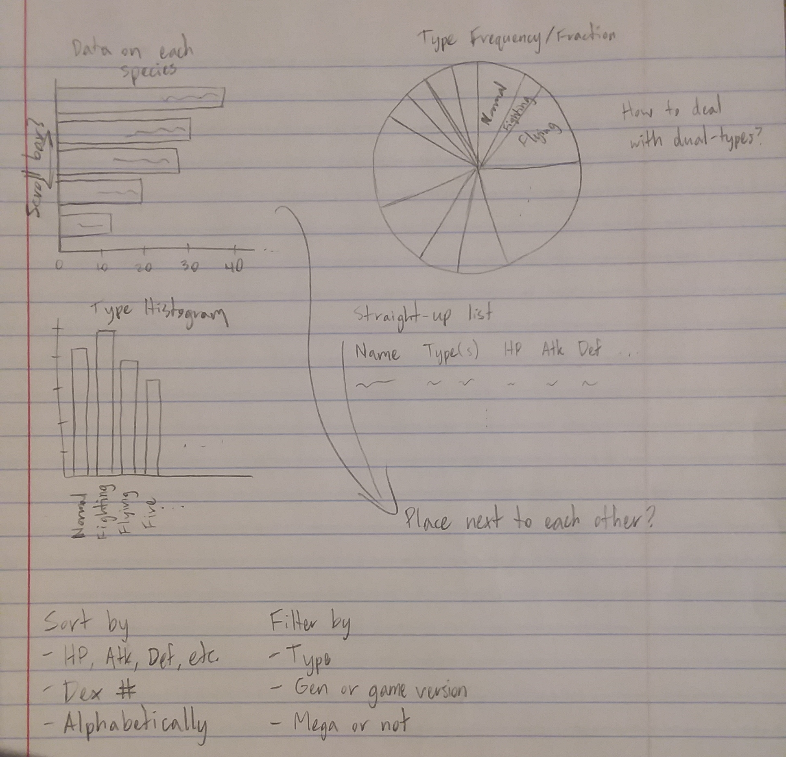
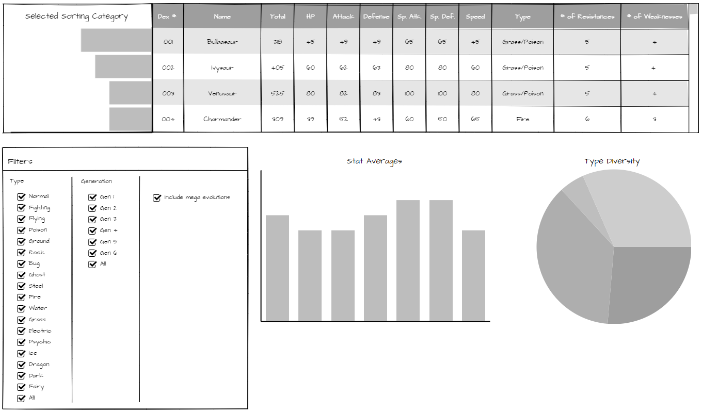
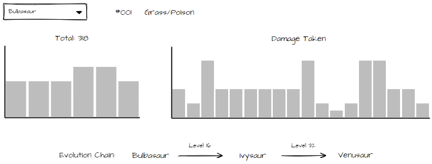
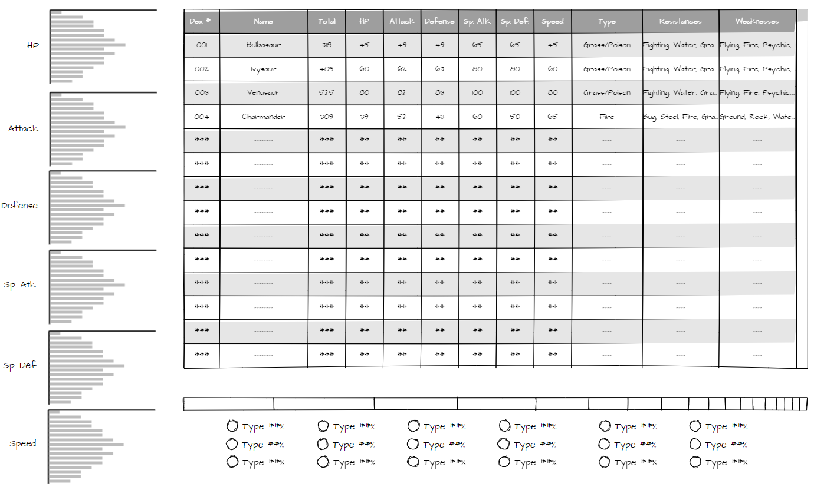
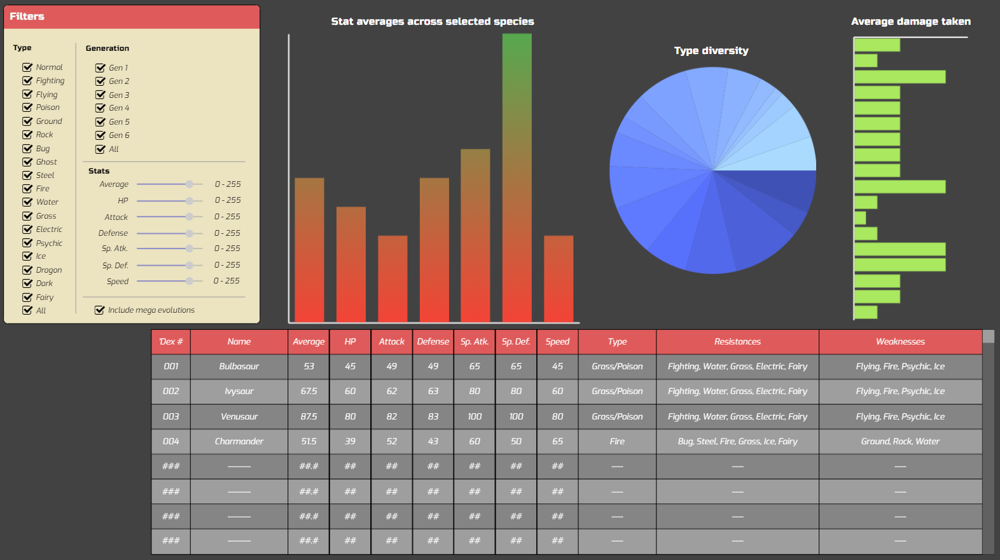
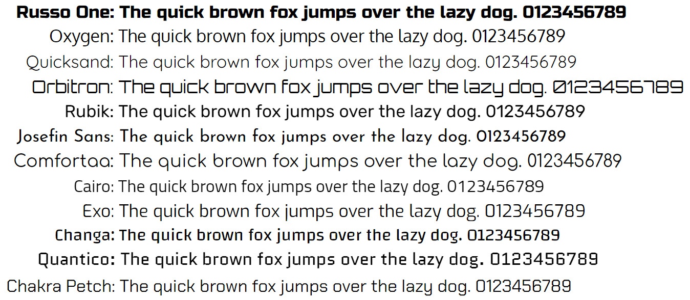

# Pokémon Data Visualization
This browser application is an interactive data visualization of Pokémon species. It was designed for studying various
trends across types and generations, e.g. the percentage of Pokémon of the first three generations with defense stats
above 100 that are Rock type, but you can also use it to simply view stats and compare species.

This was originally written for one of my software classes as an exercise in design process. A transcription of the
original report, Designing a Pokémon Data Visualization, can be found below in which I detail my thought process
throughout this project.

### Getting Started
Download a release and open index.html to start using the visualization. Note that the provided files' structure must
be maintained for the program to work. You may delete LICENSE.txt unless you plan on redistributing this project.

---

# Designing a Pokémon Data Visualization
#### Wallace Watler - 3/1/2021
For my SE3830 Human and Computer Interaction course, I was tasked with designing an interactive visualization of any
data set of my choosing and documenting my design process. I stumbled upon a data set from the
[Pokémon Database](https://pokemondb.net/) containing a bunch of information on the first 718 Pokémon and thought it
would be fun to see what I could make out of it.

For those unfamiliar with the Pokémon video game series, here’s a brief overview. As the player, you catch these unique
creatures called Pokémon and train them by battling the other Pokémon you’ll encounter while exploring the wilds and
challenging other trainers. During a battle, your team of Pokémon is pitted against the opponent’s, and each team takes
turns using the various moves they’ve learned with the goal of weakening the other team. The battle ends when all of a
team’s Pokémon faint; the team still standing is victorious.

There are many gameplay elements to consider when building a Pokémon team: you can only have up to six team members;
each species of Pokémon has different levels of ability in attack, defense, and speed; each of your Pokémon can know up
to four moves; etc. It can be very difficult to set up a top-tier team, so my design goal with this data visualization
is to provide some insight into the world of Pokémon that could make a playthrough go more smoothly.

### Who is interested in this, and what might they be looking for?
A very important question when considering the design of any software, and I think the answer here is straightforward:
Pokémon fans (such as myself), casual gamers, and other nerds who like to ponder the lore and mathematics of fictional
creations. Maybe they’ve just caught a Pokémon and want to know more about it, or maybe they’re looking for certain
characteristics in a team member and want to find a Pokémon that fits the role, or maybe they would like broader insight
into the biodiversity of a region. Whatever the case, it’s also important to know…

### What data is available? What can be asked of it? 
The Excel file I obtained from the Pokémon Database contained data on every species, every move, every evolution chain,
and every type match-up.

I began to brainstorm questions that could be answered with this data, charts that could be made, and general
observations:
- Pokémon with the best HP/Atk/Def/Spd/etc.
- Pokémon with the least/most type resistances
- Type advantage chart
- Histogram of each type
- Power/accuracy/category of moves of each type
- Quickest/slowest evolution chains
- Separate section for Mega forms
- Do some types have an affinity for certain stats?
- All of the above grouped by generation or game version
- Frequency of letters in names of Pokémon in their first evolutionary stage versus their last evolutionary stage

It was clear that there were a lot of ways to approach this project, certainly more than I came up with. Given such
high-dimensional and interconnected data, the next question was…

### What should be asked of it?
Before answering this, I like to wait for at least one day to pass since brainstorming; I find that I become less
attached to my ideas and am more willing to toss bad ones. So, the next day, I looked over each of the ideas I had
generated and asked myself whether it aligned with the desires of the expected audience. One idea that didn’t make the
cut was the quickest/slowest evolution chains. In my experience, people tend not to care much about how long it takes
for their Pokémon to evolve. Also, some Pokémon don’t have a particular level that they evolve at, instead evolving when
some arbitrary condition is met. Another idea cut was the frequency of letters in Pokémon names in their first
evolutionary stage versus their last evolutionary stage. It’s an interesting psychological question – perhaps more
letters from the end of the alphabet are used in later evolutionary stages – but this doesn’t have any bearing on
gameplay. 

I also considered how easy it would be to work with each piece of data since I had limited time to complete this
project. I ended up discarding the entire sheet of moves; some moves don’t have power or accuracy stats, many moves have
unique effects that aren’t quantifiable, and nothing else in the provided data set links to the moves anyways.

### Design Phase
Now that I had my design goals laid out, I came up with three initial drafts that each aimed to meet them in a unique
way.

#### Draft 1

The idea behind Draft 1 was to tabulate the data on each species and supplement it with graphs that summarize the
selected population. Each header of the table, except for Type, can be clicked on to sort the species by that value, and
those values are presented in the bar graph to the left. The table entries can be filtered by type and/or game
generation.

<table>
  <tbody>
    <tr>
      <th>Pros</th>
      <th>Cons</th>
    </tr>
    <tr>
      <td>
        <ul>
          <li>Filter + sort accommodates both users looking for data on a specific species and those wanting general
              insights into sets of species</li>
          <li>Quick to use</li>
          <li>Clean look</li>
        </ul>
      </td>
      <td>
        <ul>
          <li>Leaves out a lot of information on type matchups</li>
          <li>“Selected sorting category” graph doesn’t make sense if the category is the ‘Dex number or the species
              name</li>
        </ul>
      </td>
    </tr>
  </tbody>
</table>

#### Draft 2

With Draft 2, I took a simpler approach. The species are listed alphabetically in a dropdown box; when one is selected,
its ‘Dex number and type(s) are displayed to the right. The left bar graph shows its base stats, and the right bar graph
shows its type matchups in the form of the multiplier on damage taken from each type. The evolution chain is shown at
the bottom, including the conditions under which each evolution happens.

<table>
  <tbody>
    <tr>
      <th>Pros</th>
      <th>Cons</th>
    </tr>
    <tr>
      <td>
        <ul>
          <li>Minimal interactivity, easier to code</li>
          <li>Includes information on evolution chains</li>
        </ul>
      </td>
      <td>
        <ul>
          <li>Would take a long time to find a species in the dropdown</li>
          <li>No way to look up or compare information besides by species name</li>
        </ul>
      </td>
    </tr>
  </tbody>
</table>

#### Draft 3

For Draft 3, I went with a design similar to this
[airline on-time performance visualization](http://square.github.io/crossfilter/). Users can click and drag over a range
of values in any of the bar graphs to filter the table entries, and the other graphs will update appropriately. Like in
Draft 1, all the table headings besides Type can be clicked to sort by that value.

<table>
  <tbody>
    <tr>
      <th>Pros</th>
      <th>Cons</th>
    </tr>
    <tr>
      <td>
        <ul>
          <li>All relationships between the base stats can be delved deep into</li>
          <li>Lists type matchups</li>
        </ul>
      </td>
      <td>
        <ul>
          <li>Busy to look at</li>
          <li>Difficult to code the bar graph filters</li>
          <li>No type or generation filters</li>
        </ul>
      </td>
    </tr>
  </tbody>
</table>

### Final Draft

#### Layout
I decided that Draft 1 was the best of the three drafts since it gives the most flexibility for viewing the data without
being too visually cluttered, so I used it as the foundation for the final draft. While sketching out the final, I did
some rearranging:
- Moved the table to the bottom so that the table headers could double as labels for the stat averages graph
- Replaced the total base stats with the average of the base stats (just divide by 6) so that it can be displayed more
  easily on the same graph as the rest of the stats
- Removed the “selected sorting category” graph since it was a bit awkward and would probably cause more confusion than
  what it’s worth

I also worked in several elements from the other two drafts that I liked:
- Type resistances/weaknesses listed out in words (not just a count) from Draft 3
- Stat filters akin to Draft 3
- Graph of damage taken from Draft 2

Although I wasn’t able to show it with the prototyping tool I used, the stat filters will have two sliders, one for the
minimum value and one for the maximum, and all the table headers besides “Type” will have up/down arrows next to them to
control the sorting order.

#### Fonts
For a visualization of Pokémon data, I thought it was only fitting to use fonts that capture the adventurous, slightly
sci-fi feel of the games. I immediately knew that a sans serif font would be preferred, so I looked through Google Fonts
and picked out some that seemed promising.

The first few I came across included Oxygen, Quicksand, and Rubik. They all look nice but rather plain, so I kept
searching. Josefin Sans and Comfortaa were more interesting but looked more like what you’d find in a frozen yogurt shop
than in Pokémon content. Orbitron is fun, and I liked the retro-futuristic aesthetic, but it’s a bit difficult to read.
Then I found Russo One: bold, angular, and easy to read. I settled on it for the graph names and filter headers. Looking
for a complementary font for general text, I found Cairo, Changa, Quantico, Chakra Petch, and finally settled on Exo.
It’s also angular but with softened corners, making it easier on the eyes, and when italicized has a tech feel that I
believe suits Pokémon beautifully.

#### Colors
The colors most associated with Pokémon are red, white, black, yellow, and blue, so I limited the non-graph parts of the
visualization to shades of said colors. With the help of [color-hex](https://www.color-hex.com/), I put together the
palette shown below.

\#424242, #FFFFFF, #DF5B5B, #ECE3C1, #5B5BDF

I wanted my palette to be rather subdued despite the exciting look that I was hoping to achieve overall, hence the
earthy red, sandy yellow, and dark gray instead of black. The reason why is that Pokémon does some of the work for me in
that every type has an associated color:

<table>
  <tbody align="center">
    <tr style="color:white;">
      <td style="background-color:#A8A878;">NORMAL</td>
      <td style="background-color:#F08030;">FIRE</td>
    </tr>
    <tr style="color:white;">
      <td style="background-color:#C03028;">FIGHTING</td>
      <td style="background-color:#6890F0;">WATER</td>
    </tr>
    <tr style="color:white;">
      <td style="background-color:#A890F0;">FLYING</td>
      <td style="background-color:#78C850;">GRASS</td>
    </tr>
    <tr style="color:white;">
      <td style="background-color:#A040A0;">POISON</td>
      <td style="background-color:#F8D030;">ELECTRIC</td>
    </tr>
    <tr style="color:white;">
      <td style="background-color:#E0C068;">GROUND</td>
      <td style="background-color:#F85888;">PSYCHIC</td>
    </tr>
    <tr style="color:white;">
      <td style="background-color:#B8A038;">ROCK</td>
      <td style="background-color:#98D8D8;">ICE</td>
    </tr>
    <tr style="color:white;">
      <td style="background-color:#A8B820;">BUG</td>
      <td style="background-color:#7038F8;">DRAGON</td>
    </tr>
    <tr style="color:white;">
      <td style="background-color:#705898;">GHOST</td>
      <td style="background-color:#705848;">DARK</td>
    </tr>
    <tr style="color:white;">
      <td style="background-color:#B8B8D0;">STEEL</td>
      <td style="background-color:#EE99AC;">FAIRY</td>
    </tr>
  </tbody>
</table>

Naturally, I wished to use those colors for the type diversity chart and damage taken chart (again, I wasn’t able to
show that due to tool limitations); however, that would essentially make those charts into rainbows. I therefore needed
the background, table, and filter control panel to ground the visualization with milder colors. As for how I applied the
colors, I used:
- Dark gray as the background and white text to both enhance the tech look of the Exo font and to allow the graphs to
  pop more
- The red for the table headers and filter panel header as it’s the boldest in my palette
- The sandy yellow with black text for the filter panel to differentiate it from the rest of the visualization,
  indicating that it can be interacted with
- The blue on the stat sliders as an accent

I had also planned on coloring the base stat values in the table by quantile – red, orange, yellow, green, and blue from
lowest to highest – to aid in comparison between individual species.

### Implementation
Given the level of interactivity and copius visual elements required in my design, I decided to forgo chart builders
such as Tableau, instead implementing the visualization as a web application using Chart.js for the graphs. It turned
out almost exactly as I had planned, with the only differences being some minor layout changes and that I didn’t color
the base stat values.

### Retrospective
I was certainly successful in designing an interactive visualization of a data set, but my process for doing so could’ve
been better. The biggest issue was time. I went *way* over my time budget, and I think part of that is because I spent
too long trying to come up with the best possible design during the brainstorming and early design phases instead of
just getting several rough ideas down. After I had formulated Draft 1, I struggled to come up with two more designs that
were significantly different because I felt as though I already knew what I wanted this visualization to look like.
Another factor in the time problem was that it took me a lot longer than I expected to write the code. It has been a
couple of years since my last web programming course, and I had forgotten much of it, so I took the time to relearn it.
I also had to jump through a few hoops regarding file-reading with Javascript to allow the code to run on anyone’s
device. I was originally going to have Javascript read a CSV file containing the Pokémon data, but then I found out that
Javascript cannot read local files for security reasons, and I knew that I’d have to write a script to convert the CSV
into pure Javascript, effectively hard-coding the data. When I realized these issues, I did consider using Tableau or
some other tool after all, but I figured that it would be more of a hassle to learn a new tool that may or not do what I
want it to than to simply continue with my custom implementation. Were I to do this project again, I would take a moment
before even designing anything to research the tools at my disposal and their capabilities so that I don’t try something
that’s too ambitious. Other than the time issue, the project went quite smoothly. I followed the right design steps in
the right order, always keeping the users in mind, and I think that shows in the final product. If I were a Pokémon fan
that found this web page for the first time, I know I’d bookmark it.
